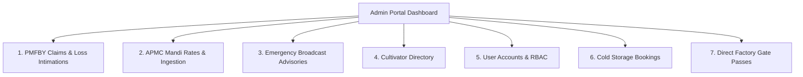

# RythuSetu — Administrative & Extension Officer Operations Manual

**Version:** 0.4.0  
**Target Roles:** Mandal Agriculture Officers (MAO), Agriculture Extension Officers (AEO), APMC Market Secretaries, System Administrators  
**Effective Date:** 2026-09-26  

---

## 1. Accessing the Officer & Admin Portal

The RythuSetu Admin Portal provides administrative control over crop loss surveys, emergency district advisories, APMC mandi rates, user access, and post-harvest linkages.

### 1.1 Login Credentials
1. Open the RythuSetu web application at `https://rythu-setu.vercel.app` (or your production domain).
2. Click **Sign In** in the top navigation header.
3. Enter your assigned administrative or officer credentials:
   - **Default Initial Username:** `admin`
   - **Initial Password:** Configured via `ADMIN_INITIAL_PASSWORD` during deployment.
4. Upon successful authentication, an **Admin Portal** button appears in the navigation bar with an officer shield badge.
5. Click **Admin Portal** to enter the administrative console.
6. To inspect the portal from a cultivator's perspective at any time, click **Switch to Farmer View** in the top-right corner.

---

## 2. Admin Dashboard & Subsystem Overview

The console features a top KPI summary and 7 functional management tabs:



### Top KPI Summary Cards
- **Registered Cultivators:** Total onboarded smallholders and tenant farmers across districts.
- **Pending PMFBY Claims:** Intimations awaiting field verification or survey scheduling.
- **Active Emergency Alerts:** Live district-level advisories currently broadcast to farmers.
- **Total Estimated Loss Valuation:** Cumulative rupee valuation of reported crop loss claims.

---

## 3. PMFBY Claim Management & Field Verification

The **Claims** tab manages the entire lifecycle of Pradhan Mantri Fasal Bima Yojana crop damage intimations.

### 3.1 Understanding the 72-Hour Statutory Window
Under PMFBY operational guidelines, localized calamities (hailstorm, cloudburst, inundation, post-harvest cyclone damage) must be intimated within **72 hours of the loss event**.
- **`is_within_window = true` (Green Badge):** Intimation was registered inside 72 hours. These claims qualify for automated joint survey scheduling.
- **`is_within_window = false` (Amber Badge):** Intimation exceeded 72 hours. Requires special officer justification and DAO sign-off.

### 3.2 Reviewing Intimations & Evidence
1. Filter claims by status: `All`, `Submitted`, `Under Review`, `Survey Scheduled`, `Settled`, `Rejected`.
2. Inspect submitted loss details: Cultivator Name, Survey Number, Affected Acreage, Crop Type, and Loss Date.
3. Click **View Loss Photo Evidence** to inspect photographic evidence validated via magic-byte integrity checks.

### 3.3 Updating Claim Status & Adding Officer Notes
1. Click **Review & Update Status** on the target claim.
2. Select the updated status:
   - **`Under Review`:** Initial dossier verification in progress.
   - **`Survey Scheduled`:** Joint field inspection scheduled with Agriculture Department and Insurance Loss Assessor.
   - **`Approved for Settlement`:** Field survey verified loss; forwarded to insurance consortium for claim disbursement.
   - **`Rejected`:** Claim invalidated (e.g. non-notified crop, duplicate submission, or unverified damage).
3. Enter **Officer Verification Notes** (e.g., *"Joint survey completed on 2026-09-28 with AIC Surveyor. Verified 60% lodging damage due to excessive inundation."*).
4. Click **Save & Notify Farmer**. This writes an immutable entry into `claim_events` and automatically dispatches an in-app notification to the cultivator.

---

## 4. APMC Mandi Market Intelligence & Upstream Sync

The **Mandi** tab provides administrative control over spot prices, arrivals, and upstream government data ingestion.

### 4.1 Ingestion Telemetry Card
The top card displays the health and status of upstream daily market syncs:
- **Upstream Source:** `Data.gov.in (OGD)` or `Agmarknet Portal`.
- **Last Sync Timestamp:** UTC / IST time of the last sync run.
- **Execution Status:**
  - `SUCCESS` (Green): Upstream data retrieved and upserted.
  - `PARTIAL` (Yellow): Some records had schema mismatches or missing modal prices.
  - `OFFLINE_UNCONFIGURED` (Orange): `DATA_GOV_API_KEY` is not set; running on verified baseline seeded data.
  - `FAILED` (Red): Network failure or upstream rate limit encountered.
- **Telemetry Counters:** Records received, inserted, updated, and rejected.

### 4.2 Triggering a Manual Upstream Sync
To fetch latest APMC arrivals immediately (outside the nightly 01:00 IST cron):
1. In the Mandi tab, click **Sync Mandi Data**.
2. The backend initiates an asynchronous ingestion run via `MandiIngestionService` for configured states (`Telangana, Andhra Pradesh`).
3. Refresh the telemetry card after 10–15 seconds to observe updated counts.

### 4.3 Understanding Data Freshness Tiers
Every price displayed in RythuSetu bears a transparency badge:
- **`LATEST`:** Arrival date matches current calendar day.
- **`RECENT`:** Arrival date within the last 1–2 days.
- **`DELAYED`:** Data is 3–5 days old (common over weekends or public yard holidays).
- **`STALE`:** Data is older than 5 days.

### 4.4 Manually Publishing or Editing Spot Market Prices
Mandal Agriculture Officers can record local yard spot prices:
1. Click **+ Add Spot Mandi Rate**.
2. Enter Crop, Variety, Yard Name (e.g. *Warangal Enumamula Yard*), District, Minimum Price, Maximum Price, Modal Price (INR/Quintal), and Arrival Quantity (Quintals).
3. Submit the form. The record is published with `verification_status: "OFFICER_ENTERED"`.
4. Existing entries can be updated by clicking **Edit** (pencil icon) or retired using **Delete** (trash icon).

---

## 5. Emergency Broadcast Advisories

The **Broadcasts** tab enables Mandal Agriculture Officers to push critical warnings directly to farmers' notification feeds.

### 5.1 Publishing an Advisory
1. Navigate to the **Broadcasts** tab.
2. Form fields:
   - **Advisory Title:** Concise headline (e.g., *Yellow Rust Precautionary Advisory for Nizamabad*).
   - **Target Crop:** Select specific crop (Cotton, Chilli, Paddy, Turmeric, Maize) or *All Crops*.
   - **Severity Level:**
     - `Moderate`: Informational or standard cultural practice reminder.
     - `High`: Emerging pest attack or imminent rainfall advisory.
     - `Critical`: Severe weather alert or PMFBY 72-hour filing deadline notice.
   - **Advisory Body:** Actionable recommendations, chemical dosages (e.g. *Chlorantraniliprole 18.5% SC @ 0.3ml/L*), and departmental contact numbers.
3. Click **Dispatch Broadcast Advisory**.
4. The advisory is saved to `broadcast_alerts` and broadcast to registered cultivators in that district.

---

## 6. User Management & Role-Based Access Control (RBAC)

The **Users** tab lists all registered platform accounts.

### 6.1 Understanding System Roles
- **`farmer`:** Smallholders and tenant cultivators. Permitted to access profiles, view mandi rates, file claims, book machinery, and use Agri Khata.
- **`officer`:** Field-level Agriculture Extension Officers and MAOs. Permitted to review claims, schedule surveys, post broadcast advisories, and edit mandi rates.
- **`admin`:** District Agriculture Officers and Platform Administrators. Full access including user role modification, audit log inspection, and upstream pipeline control.
- **`super_admin`:** Root DevOps credential with complete infrastructure authority.

### 6.2 Managing User Accounts
- Search users by username, full name, phone number, or district.
- Filter by role (`farmer`, `admin`) or activity status (`online`, `offline`).
- Inactivate compromised or fraudulent accounts by toggling user status (`is_active = false`).

---

## 7. Scheme Data Management

Government welfare schemes displayed in the **Scheme Finder** are managed declaratively in `backend/data/schemes.json` and mirrored in `frontend/src/data/schemes.json`.

### 7.1 Scheme Structure
Each scheme definition includes:
```json
{
  "id": "pm-kisan",
  "name": "PM-KISAN (Pradhan Mantri Kisan Samman Nidhi)",
  "state": "All",
  "crops": ["All"],
  "seasons": ["All"],
  "annual_benefit_inr": 6000,
  "benefit_type": "Direct Benefit Transfer",
  "eligibility_rules": "All landholding farmer families with cultivable land.",
  "official_portal": "https://pmkisan.gov.in"
}
```

### 7.2 Updating or Adding New Welfare Schemes
1. Edit `backend/data/schemes.json`.
2. Ensure values for `annual_benefit_inr` and eligibility constraints are verified against official government gazette notifications.
3. Run test suite: `pytest test_features.py` to verify scheme matching heuristics.
4. Commit changes to version control; redeploying updates the scheme catalog immediately.

---

## 8. Cold Storage & Direct Factory Pass Approvals

### 8.1 Cold Storage Bookings (`Storage` Tab)
- Review farmer warehouse reservations.
- Verify bag counts, commodity grade, and storage duration.
- Click **Approve Booking & Allot Bay** to generate warehouse entry clearance.
- Ensure the farmer is informed of e-NWR pledge loan eligibility (up to 75% loan value).

### 8.2 Direct Factory Delivery Gate Passes (`Factory` Tab)
- Farmers bypass mandi brokers by delivering directly to processing mills (ginning mills, oil extractors, spice processors).
- Review gate pass allocations and agreed benchmark prices.
- Verify delivery dates and approve security entry clearance.

---

## 9. System Health Probes & Ingestion Key Setup

### 9.1 Interpreting Health Probes
Agriculture Officers and DevOps engineers can verify operational status via dedicated endpoints:
- **`GET /health`:** Confirms Python web process is running.
- **`GET /readiness`:** Deep probe verifying:
  - Database connectivity (`SELECT 1`).
  - Storage directory write permissions for evidence photos.
  - Production security validation (secrets entropy).
- **`GET /health/mandi`:** Verifies data.gov.in connectivity and recent ingestion latency.

### 9.2 Setting `DATA_GOV_API_KEY` in Render Dashboard
To transition the Mandi Ingestion Pipeline from baseline seeded mode to live daily sync:
1. Register on [data.gov.in](https://data.gov.in).
2. Go to **My Account** $\rightarrow$ **API Keys** and generate an API key.
3. Open [Render Dashboard](https://dashboard.render.com).
4. Navigate to **Services** $\rightarrow$ `rythusetu-backend` $\rightarrow$ **Environment**.
5. Add/Update environment variable:
   - **Key:** `DATA_GOV_API_KEY`
   - **Value:** `<your-40-character-ogd-api-key>`
6. Repeat for `rythusetu-mandi-sync` cron job.
7. Click **Save Changes**. Live daily APMC sync will run automatically every night at 01:00 IST.

---

## 10. Audit Logs & Forensic Inspection

All administrative actions are permanently logged in the `audit_logs` table (`app.models.AuditLog`).

To inspect audit records:
```bash
# Query the 20 most recent administrative actions
curl -s -H "Authorization: Bearer <ADMIN_TOKEN>" \
  "https://rythusetu-backend.onrender.com/api/v1/admin/dashboard-stats"
```
Or execute SQL in PostgreSQL:
```sql
SELECT timestamp, username, role, action, resource_type, resource_id, ip_address
FROM audit_logs
WHERE action IN ('CLAIM_STATUS_UPDATE', 'MANDI_PRICE_MUTATION', 'BROADCAST_CREATED')
ORDER BY timestamp DESC
LIMIT 50;
```
Every record contains the actor's username, IP address, exact state mutation, and timestamp, guaranteeing auditability for government inspections and PMFBY audits.
