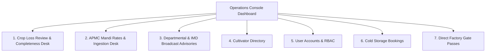

# RythuSetu — Operations Console & Data Verification Operations Manual

**Version:** 1.0.0  
**Target Roles:** Operations Leads, Data Quality Verifiers (`data_verifier`), Support Agents (`support_agent`), Platform Administrators (`admin`), System Administrators (`super_admin`)  
**Effective Date:** 2026-09-26  

---

## 1. Accessing the Operations Console

The RythuSetu Operations Console provides internal administrative and verification control over crop loss preparation reviews, agricultural broadcast advisories, APMC market rate quality, user accounts, and post-harvest linkages.

> [!IMPORTANT]
> **Independent Platform Clarification:**
> RythuSetu is an independent agricultural preparatory platform. Government officers are not a core application role or mandatory workflow step. Government scheme sanctioning, joint damage surveys, and claim payouts occur exclusively on official government portals (such as `pmfby.gov.in` and `pmkisan.gov.in`) and authorized district departments. Internal team members operate as **Data Verifiers** (`data_verifier`) or **Platform Administrators** (`admin`).

### 1.1 Login Credentials
1. Open the RythuSetu web application at `https://rythu-setu.vercel.app` (or your local/staging environment).
2. Click **Sign In** in the top navigation header.
3. Enter your assigned administrative or verifier credentials:
   - **Default Administrator:** `admin` / configured via `ADMIN_INITIAL_PASSWORD`.
   - **Default Verifier Account:** `verifier` / `Verifier2026!Secure`.
4. Upon successful authentication, an **Operations Console** button appears in the navigation bar.
5. Click **Operations Console** to enter the administrative review desk.
6. To inspect the portal from a cultivator's perspective at any time, click **Switch to Farmer View** in the top-right corner.

---

## 2. Operations Dashboard & Subsystem Overview

The console features a top KPI telemetry summary and 7 functional management desks:

### Top KPI Summary Cards
- **Registered Cultivators:** Total onboarded smallholders and tenant farmers across districts.
- **Pending Reviews:** Crop loss intimation dossiers awaiting completeness verification.
- **Dossiers Verified Complete:** Intimations checked for completeness and ready for farmer submission on `pmfby.gov.in`.
- **Estimated Valuation Tracked:** Cumulative rupee valuation of self-reported and prepared loss dossiers.

---

## 3. Crop Loss Preparation & Review Desk

The **Crop Loss Review Desk** oversees cultivator dossiers prepared under the Pradhan Mantri Fasal Bima Yojana (PMFBY) guidelines.

### 3.1 Understanding the 72-Hour Statutory Window
Under PMFBY operational guidelines, localized calamities (hailstorm, cloudburst, inundation/submergence, landslide, post-harvest cyclone damage) must be intimated within **72 hours of the loss event** directly to the insurance company or official portal.
- **`is_within_window = true` (Green Badge):** Intimation was recorded inside 72 hours.
- **`is_within_window = false` (Amber Badge):** Intimation exceeded 72 hours. The farmer is advised of the statutory limitation when filing on official channels.

### 3.2 Reviewing Intimations & Evidence
1. Filter dossiers by stage: `All Intimations`, `Stage 1: Awaiting Review`, `Stage 2: Completeness Verified`, `Stage 3: Preparation Ready`, `Stage 4: Forwarded to Official Portal`.
2. Inspect submitted loss details: Cultivator Name, Survey Number, Mandal, Village, Affected Acreage, Crop Type, and Loss Date.
3. Click **View Loss Photo Evidence** to inspect photographic evidence validated via magic-byte integrity checks.

### 3.3 Verifying Dossier Completeness
Internal Data Verifiers perform quality checks to maximize farmer claim success on official portals:
1. Click **Review & Update Status** on the target dossier.
2. Verification actions:
   - **`Verify Completeness`:** Confirms survey number, village, damage percent, and date of loss are present.
   - **`Confirm Pack Ready`:** Generates standard preparation slip with Scale of Finance calculation and physical document checklist.
   - **`Mark Forwarded to Official Portal`:** Acknowledges farmer's submission on `pmfby.gov.in` or via CSC kiosk.
   - **`Flag Incomplete`:** Notes missing field documentation so the cultivator can rectify before filing.
3. Enter **Internal Verifier Notes** (e.g., *"Survey number validated against Warangal revenue records. Photo evidence confirms submergence symptoms."*).
4. Save the update. An event log is recorded in `claim_events` with actor role `data_verifier`.

---

## 4. APMC Mandi Market Intelligence & Upstream Sync

The **Mandi** desk provides administrative control over daily APMC market prices, arrivals, and upstream government data ingestion.

### 4.1 Ingestion Telemetry Card
The top card displays the health and status of upstream daily market syncs:
- **Upstream Source:** `Data.gov.in (OGD)` or `Agmarknet Portal`.
- **Last Sync Timestamp:** UTC / IST time of the last sync run.
- **Execution Status:**
  - `SUCCESS` (Green): Upstream data retrieved and upserted into `mandi_prices`.
  - `PARTIAL` (Yellow): Some records had schema mismatches or missing modal prices.
  - `OFFLINE_UNCONFIGURED` (Orange): `DATA_GOV_API_KEY` is not set; running on verified baseline seeded data.
  - `FAILED` (Red): Upstream rate limit or connection issue.
- **Telemetry Counters:** Records received, inserted, updated, and rejected.

### 4.2 Triggering a Manual Upstream Sync
To fetch latest APMC arrivals immediately (outside the nightly 01:00 IST cron):
1. In the Mandi tab, click **Sync Mandi Data**.
2. The backend initiates an ingestion run via `MandiIngestionService` for configured states (`Telangana, Andhra Pradesh`).
3. Refresh the telemetry card after 10–15 seconds to observe updated counts.

### 4.3 Data Freshness Tiers
Every price displayed in RythuSetu bears a transparency badge:
- **`LATEST`:** Arrival date matches current calendar day.
- **`RECENT`:** Arrival date within the last 1–2 days.
- **`DELAYED`:** Data is 3–5 days old (common over weekends or public yard holidays).
- **`STALE`:** Data is older than 5 days.

### 4.4 Publishing or Editing Market Benchmarks
Authorized Data Verifiers can record verified local yard spot prices:
1. Click **+ Publish New Mandi Entry**.
2. Enter Crop, Variety, Yard Name (e.g. *Warangal Enumamula Yard*), District, Minimum Price, Maximum Price, Modal Price (INR/Quintal), and Arrival Quantity (Quintals).
3. Submit the form. The record is published with `verification_status: "VERIFIER_ENTERED"`.
4. Existing entries can be updated or retired.

---

## 5. Departmental & IMD Broadcast Advisories

The **Emergency Alerts** tab enables operations staff to distribute official advisories from State Agriculture Departments, Agricultural Universities, or IMD.

### 5.1 Publishing an Advisory
1. Navigate to the **Emergency Alerts** tab.
2. Form fields:
   - **Advisory Title:** Concise headline (e.g., *Yellow Rust Precautionary Advisory for Nizamabad*).
   - **Target Crop:** Select specific crop (Cotton, Chilli, Paddy, Turmeric, Maize) or *All Crops*.
   - **Severity Level:**
     - `Moderate`: Standard cultural practice or fertilizer schedule reminder.
     - `High`: Emerging pest attack or imminent rainfall advisory.
     - `Critical`: Severe weather alert or PMFBY 72-hour filing deadline notice.
   - **Advisory Body:** Actionable recommendations, recommended IPM practices, and official helpline numbers (14447, 1800-180-1551).
   - **Issued By:** Official agency designation (e.g., *Telangana State Agriculture Department Advisory / IMD*).
3. Click **Dispatch Broadcast Advisory**.
4. The advisory is saved to `broadcast_alerts` and visible in farmer dashboards.

---

## 6. User Management & Role-Based Access Control (RBAC)

The **Users** tab lists all registered platform accounts.

### 6.1 Application Role Architecture
RythuSetu uses five distinct roles:
- **`farmer`:** Smallholders and tenant cultivators. Accesses dashboard, crops doctor, mandi rates, loss assistant, machinery, and Agri Khata.
- **`data_verifier`:** Internal platform verification team member. Reviews crop loss dossier completeness, validates APMC mandi data, and enters verified price benchmarks.
- **`support_agent`:** Customer service agent. Resolves farmer support tickets and guides cultivators through official portals.
- **`admin`:** Operations lead and system administrator. Manages user accounts, audit logs, and system configuration.
- **`super_admin`:** Root DevOps credential with complete infrastructure authority.

> [!NOTE]
> Legacy `officer` accounts in existing databases are automatically migrated to `data_verifier` (or `admin`) upon startup via Alembic migration `c3d4e5f6a7b8`.

### 6.2 Managing User Accounts
- Search users by username, full name, phone number, or district.
- Filter by role (`All Roles`, `Cultivators`, `Data Verifiers`, `Support Agents`, `Administrators`) or activity status (`Online`, `Offline`).
- Deactivate compromised accounts by toggling user status (`is_active = false`).

---

## 7. Scheme Data Management

Government welfare schemes displayed in the **Scheme Navigator** are managed declaratively in `backend/data/schemes.json` and mirrored in `frontend/src/data/schemes.json`.
Every scheme includes:
- `government_department`: Issuing ministry or department
- `application_channel`: Official portal, MeeSeva, or bank branch
- `required_documents`: Document checklist
- `official_url`: Direct link to official government portal
- `helpline`: Dedicated toll-free phone helpline

---

## 8. Incident Response & Troubleshooting

### 8.1 Rate Limiting (HTTP 429)
The backend enforces rate limits:
- Login attempts: 5 requests / 60 seconds
- General API: 60 requests / 60 seconds

### 8.2 Security Headers & Audit Logs
RythuSetu enforces:
- Content-Security-Policy (CSP)
- Strict-Transport-Security (HSTS)
- X-Content-Type-Options: nosniff
- X-Frame-Options: DENY
All authentication events and claim updates are logged to the `audit_logs` table.
