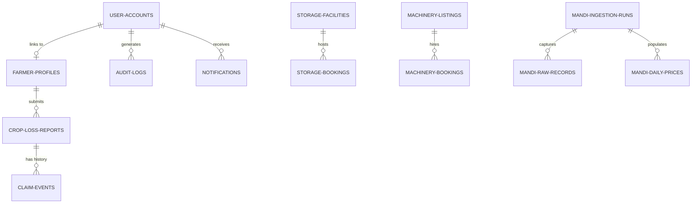

# RythuSetu — Production Database Architecture & Schema Reference

**Version:** 0.4.0  
**Effective Date:** 2026-09-26  
**Primary Engine (Production):** PostgreSQL 16+ via Render Managed Database  
**Primary Engine (Development):** SQLite 3 with WAL mode  
**ORM & Migration Framework:** SQLAlchemy 2.0 + Psycopg 3 + Alembic  

---

## 1. Database Architecture & Multi-Engine Strategy

RythuSetu employs a dual-engine architecture:
- **Local Development / CI Test:** Zero-configuration SQLite (`backend/rythusetu.db` or in-memory `:memory:`). Uses connection pooling with foreign key enforcement (`PRAGMA foreign_keys=ON;`).
- **Production Environment:** PostgreSQL 16+ hosted on Render (`rythusetu-db`). Connects through the modern asynchronous/synchronous `psycopg` driver using connection pooling (pool size: 10, max overflow: 20, recycle: 1800s).

Engine selection is governed dynamically by `DATABASE_URL` in `backend/app/db.py`:
```python
if database_url.startswith("postgres://"):
    database_url = database_url.replace("postgres://", "postgresql+psycopg://", 1)
elif database_url.startswith("postgresql://") and "+psycopg" not in database_url:
    database_url = database_url.replace("postgresql://", "postgresql+psycopg://", 1)
```

---

## 2. Relational Schema Overview (19 Tables)

The RythuSetu data store consists of 19 normalized, audited relational tables organized by business domain.



### 2.1 Identity, RBAC & Cultivator Profiles
1. **`user_accounts`**
   - Core authentication identity table supporting 4 roles: `farmer`, `officer`, `admin`, `super_admin`.
   - Stores `username`, `hashed_password` (Bcrypt), `name`, `phone`, `role`, `designation`, `district`, `state`, `farmer_profile_id`, `is_active`, and login timestamps.
2. **`farmer_profiles`**
   - Agricultural holding information linked to a cultivator.
   - Stores `name`, `language` (English/Telugu/Hindi), `state`, `district`, `mandal`, `village`, `crop`, `season`, `land_area_acres`, and timestamps.

### 2.2 PMFBY Crop Loss & Claims Lifecycle
3. **`crop_loss_reports`**
   - Statutory crop loss claim records intimation submitted by cultivators.
   - Tracks `reference_number` (e.g., `RYTHU-CLAIM-2026-1001`), `farmer_id`, `crop`, `damage_type` (Flood, Drought, Pest, etc.), `loss_date`, `affected_area_acres`, `damage_percent`, `evidence_filename`, `status` (`Submitted`, `Under Review`, `Survey Scheduled`, `Settled`, `Rejected`), and 72-hour reporting compliance flag (`is_within_window`).
4. **`claim_events`**
   - Append-only immutable audit trail for every PMFBY claim status transition.
   - Tracks `claim_id`, `actor_id`, `actor_role`, `actor_name`, `old_status`, `new_status`, `notes`, and `created_at`.

### 2.3 Post-Harvest Storage & Cold Chain
5. **`storage_facilities`**
   - Registry of WDRA-regulated cold storages, rural godowns, and CA chambers.
   - Stores `id` (e.g., `cs-gtr-01`), `name`, `district`, `capacity_mt`, `available_space_mt`, `commodities_json`, `temp_range`, `humidity_rh`, `monthly_rent_per_bag`, `enwr_pledge_loan` eligibility, and contact details.
6. **`storage_bookings`**
   - Reservations made by farmers for commodity storage.
   - Stores `booking_token`, `facility_id`, `farmer_name`, `phone`, `commodity`, `bags_count`, `duration_months`, `total_estimated_rent_inr`, and `booking_status`.

### 2.4 Custom Hiring Centers (CHC) Machinery
7. **`machinery_listings`**
   - Equipment inventory available for hire from CHCs and private owners.
   - Stores `machinery_type`, `telugu_name`, `category` (Tractor, Harvester, Drone, Sower), `owner_name`, `owner_phone`, `district`, `mandal`, `village`, `rate_inr`, `pricing_type` (per acre / per hour), and `available` flag.
8. **`machinery_bookings`**
   - Equipment rental dispatch requests.
   - Stores `booking_token`, `machinery_id`, `farmer_name`, `phone`, `acres_or_hours`, `estimated_cost_inr`, `required_date`, `status`, and operator dispatch details.

### 2.5 Direct Factory Market & Agri Khata
9. **`direct_market_orders`**
   - Direct factory purchase gate passes bypassing market intermediaries.
   - Stores `pass_number`, `factory_id`, `factory_name`, `crop`, `allocated_quantity_qtl`, `agreed_rate_per_qtl`, `total_estimated_payout_inr`, `broker_commission_saved_inr`, `delivery_date`, and gate pass access status.
10. **`agri_khata_entries`**
    - Farm financial ledger and breakeven sale price calculations.
    - Stores `entry_code`, `farmer_name`, `crop`, `acres`, `total_cost`, `total_yield_quintals`, `breakeven_price_per_qtl`, `expected_market_price_per_qtl`, `net_profit_projected`, and detailed expense breakdown (`expenses_json`).
11. **`seed_grievances`**
    - Complaints filed against spurious seeds or failure of germination.
    - Stores `complaint_id`, `farmer_name`, `dealer_name`, `seed_brand`, `lot_number`, `germination_failed_percent`, `notes`, and review status.

### 2.6 Advisories, Notifications & Security Audit
12. **`broadcast_alerts`**
    - Mandal- and district-level emergency advisories issued by Agriculture Officers.
    - Stores `alert_code`, `title`, `district`, `state`, `severity` (`moderate`, `high`, `critical`), `target_crop`, and advisory body text.
13. **`audit_logs`**
    - Tamper-resistant log capturing security events, privilege updates, logins, and API mutations.
    - Stores `user_id`, `username`, `role`, `action`, `resource_type`, `resource_id`, `details_json`, `ip_address`, and UTC `timestamp`.
14. **`notifications`**
    - Event-driven alerts delivered to cultivators (weather warnings, claim updates, market arrivals).
    - Stores `user_id`, `category`, `title`, `message`, `severity`, `action_link`, `status` (`UNREAD`, `READ`, `DISMISSED`), and `created_at`.

### 2.7 Mandi Intelligence & MSP Reference Data
15. **`mandi_prices`**
    - Officer-curated and bulletin-verified APMC spot prices.
    - Stores `crop`, `variety`, `market`, `district`, `min_price`, `max_price`, `modal_price`, `arrival_quantity_qtl`, `recommendation`, `verification_status` (`OFFICER_ENTERED`, `BASELINE_SEEDED`, `OFFICIALLY_VERIFIED`), and confidence score.
16. **`msp_benchmarks`**
    - Statutory Minimum Support Price (MSP) benchmarks determined by the Commission for Agricultural Costs & Prices (CACP) and Cabinet Committee on Economic Affairs (CCEA), plus State Market Intervention Scheme (MIS) references.
    - Stores `commodity`, `variety`, `season` (Kharif/Rabi/Annual), `marketing_year` (e.g. `2025-26`), `government_source`, `effective_date`, and statutory `price_per_quintal`.
17. **`mandi_daily_prices`**
    - Ingested daily APMC arrival records from `data.gov.in` / Agmarknet.
    - Stores `source`, `source_record_id`, `state`, `district`, `market`, `commodity`, `variety`, `grade`, `arrival_date`, `arrival_quantity` (Tonnes), `min_price`, `max_price`, `modal_price` (INR/Qtl), `upstream_updated_at`, `data_status`, and `raw_hash`.
18. **`mandi_ingestion_runs`**
    - Telemetry records for every upstream ingestion execution.
    - Stores `source`, `started_at`, `completed_at`, `status` (`SUCCESS`, `PARTIAL`, `FAILED`, `SKIPPED`), counts of records received, inserted, updated, and rejected, and raw error messages.
19. **`mandi_raw_records`**
    - Verifiable raw upstream JSON payloads captured for provenance, legal verification, and debugging.
    - Stores `ingestion_run_id`, `source`, `raw_payload`, `payload_hash`, and `received_at`.

---

## 3. Indexing & Optimization Strategy

To ensure sub-50ms query response times under high concurrent mobile loads, indexes are strategically placed:

| Table | Index Name | Columns Indexed | Query Scenario |
|---|---|---|---|
| `user_accounts` | `ix_user_accounts_username` | `username` (Unique) | JWT authentication lookup |
| `farmer_profiles` | `ix_farmer_profiles_district` | `district`, `state` | Regional scheme and weather lookups |
| `crop_loss_reports` | `ix_crop_loss_reports_ref` | `reference_number` (Unique) | Farmer claim status tracking |
| `crop_loss_reports` | `ix_crop_loss_reports_farmer_id` | `farmer_id`, `status` | Cultivator dashboard claims listing |
| `storage_facilities` | `ix_storage_district_state` | `district`, `state` | Geolocation radius and district filters |
| `machinery_listings` | `ix_machinery_district_type` | `district`, `machinery_type` | CHC availability search |
| `audit_logs` | `ix_audit_logs_timestamp` | `timestamp`, `action` | Security forensics and compliance queries |
| `notifications` | `ix_notifications_user_status` | `user_id`, `status` | Unread notifications badge counter |
| `mandi_prices` | `ix_mandi_prices_crop_active` | `crop`, `is_active` | Real-time spot price lookups |
| `mandi_prices` | `ix_mandi_prices_district_crop` | `district`, `crop` | Local yard rate comparisons |
| `msp_benchmarks` | `ix_msp_commodity_year` | `commodity`, `marketing_year` | Mandi vs MSP gap analysis |
| `mandi_daily_prices` | `ix_mandi_commodity_date` | `commodity`, `arrival_date` | 7-day trend price chart generation |
| `mandi_daily_prices` | `ix_mandi_dist_comm_date` | `district`, `commodity`, `arrival_date` | District-level modal price queries |
| `mandi_daily_prices` | `uq_mandi_daily_record` | `state`, `district`, `market`, `commodity`, `variety`, `grade`, `arrival_date` | Unique constraint enforcing idempotent ingestion |

---

## 4. Alembic Migration Runbook

All database schema evolutions must be performed using Alembic. Never run manual `CREATE TABLE` or `ALTER TABLE` statements in production.

### Standard Commands
```bash
cd backend

# Apply all migrations to bring database up to date
alembic upgrade head

# Check the current active migration revision
alembic current

# View complete revision log and branching history
alembic history --verbose

# Roll back the most recently applied migration
alembic downgrade -1
```

### Creating New Schema Migrations
1. Modify or add models in `backend/app/models.py`.
2. Generate an autogenerated migration revision:
   ```bash
   alembic revision --autogenerate -m "add_fpo_aggregation_tables"
   ```
3. Inspect the newly generated migration file in `backend/alembic/versions/` to verify column types, nullability, and constraints.
4. Execute the migration against local dev:
   ```bash
   alembic upgrade head
   ```
5. Run test suite to ensure schema integrity:
   ```bash
   pytest test_features.py test_mandi_pipeline.py
   ```

---

## 5. Seeded Baseline Data & Master Registries

On startup, `backend/app/db_init.py` executes idempotent initialization routines:

1. **Initial Agriculture Officer / Admin:**
   - Bootstraps user `admin` with `ADMIN_INITIAL_PASSWORD` and MAO role in Warangal district.
2. **WDRA-Regulated Cold Storage Registries:**
   - Seeds verified cold chains across Guntur, Warangal, Khammam, and Kurnool with temperature ranges, rent slabs, and e-NWR pledge loan eligibility.
3. **Custom Hiring Center (CHC) Machinery:**
   - Seeds tractors, boom sprayers, drone spraying units, and paddy combine harvesters with district, hourly, and acre pricing.
4. **Emergency Broadcast Advisories:**
   - Seeds localized bacterial leaf blight notices and 72-hour PMFBY claim intimation alerts.
5. **CACP & State MIS MSP Benchmarks (17 Crops):**
   - Seeds official 2025–26 MSP statutory benchmarks: Cotton (Medium/Long Staple), Paddy (Common/Grade A), Maize, Jowar, Bajra, Groundnut, Soybean, Tur/Arhar, Moong, Urad, Chana, Chilli (MIS), and Turmeric (MIS).
6. **Authentic Baseline Mandi Prices (24 Records across 8 Major APMC Yards):**
   - Seeds validated baseline arrival transactions covering Guntur Mirchi Yard, Warangal Enumamula Yard, Khammam APMC, Nizamabad APMC, Suryapet APMC, Anantapur APMC, Kurnool APMC, and Mahbubnagar APMC.

---

## 6. Backup, Restore & Disaster Recovery

### Automated Backups (Render Managed PostgreSQL)
- Render provisions automated daily database snapshots on paid instances with 7-day retention.
- Point-In-Time Recovery (PITR) is available on Render PostgreSQL instances above the free tier.

### Manual Backup via `pg_dump`
To take an ad-hoc snapshot before major schema migrations:
```bash
# Export compressed binary custom backup
pg_dump -Fc "$DATABASE_URL" -f "rythusetu_backup_$(date +%Y%m%d_%H%M%S).dump"

# Or export human-readable plain SQL
pg_dump --clean --if-exists "$DATABASE_URL" > rythusetu_backup.sql
```

### Restore Procedure via `pg_restore`
```bash
# Restore to target database
pg_restore --clean --if-exists --no-owner --no-privileges -d "$DATABASE_URL" rythusetu_backup.dump
```

### Recovery Objectives (RPO & RTO)
- **Recovery Point Objective (RPO):**
  - **Render Free Tier:** ~24 hours (daily snapshot cadence; mandi prices can be re-synchronized via `cron_sync.py`).
  - **Render Starter/Pro Tier:** $< 1$ hour with automated WAL archiving.
- **Recovery Time Objective (RTO):**
  - **Estimated RTO:** $\approx 2$ hours to provision a new PostgreSQL instance, execute `alembic upgrade head`, restore the latest dump, and redirect backend environment variables.
