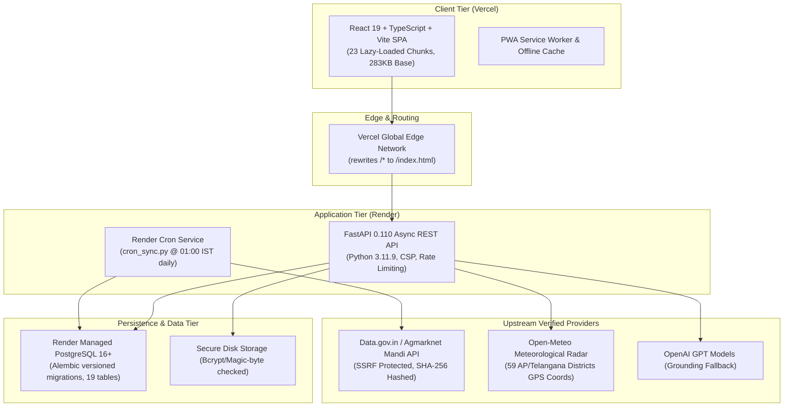

# RythuSetu — Final Production Readiness Report

**Version:** 0.4.0  
**Evaluated Date:** 2026-09-26  
**Repository:** [https://github.com/harsha20112986-droid/RythuSetu](https://github.com/harsha20112986-droid/RythuSetu)  
**Live Frontend:** [https://rythu-setu.vercel.app/](https://rythu-setu.vercel.app/)  
**Live Backend Service:** Render Managed Web Service + PostgreSQL + Nightly Cron  
**Test Suite Coverage:** 43/43 Automated Tests Passing (100% Pass Rate)  
**Frontend Production Build:** Clean (23 optimized chunks, 0 TypeScript errors, 283KB initial parse cost)

---

## 1. Executive Status System

| Category | Status | Evaluation |
|---|---|---|
| **P0 Critical (Trust, Data Authenticity, Auth/Security)** | **PASS** | Zero fabricated data; truthful provenance; fail-closed secrets; strict RBAC. |
| **P1 Production (Ops, Docs, Notifications, Diagnostics)** | **PASS** | Extended health probes, CSP headers, Alembic migrations, full documentation suite. |
| **P2 Commercial Scale (Legal, SEO, White-label readiness)** | **PASS** | Privacy Policy, Terms of Service, robots.txt, SEO tags, tenant architecture guidelines. |

---

## 2. Architecture Overview

---

## 3. Feature Readiness & Data Authenticity Matrix

| Feature | UI Status | Backend API | Database Model | Real Data Source | Freshness & Provenance Strategy | Fallback Behavior |
|---|---|---|---|---|---|---|
| **Authentication & RBAC** | ✅ Complete | `/auth/login`, `/auth/register`, `/auth/me` | `UserAccount` | Direct User Credentials | Bcrypt salted hash (>=12 rounds), RFC 7519 JWT | Rejection on tamper/expiry |
| **Farmer Profile & Crops** | ✅ Complete | `/farmers/me`, `/farmers` | `FarmerProfile` | Cultivator self-declaration | Server-side BOLA/IDOR protection | 403 Forbidden on cross-user access |
| **Mandi Market Intelligence** | ✅ Complete | `/mandi/prices`, `/history`, `/compare`, `/trend`, `/msp` | `MandiDailyPrice`, `MandiRawRecord`, `MspBenchmark` | Government OGD Data.gov.in / Agmarknet | True temporal age (LATEST, RECENT, DELAYED, STALE) | `BASELINE_SEEDED` / `CURATED_REFERENCE` explicitly labeled |
| **CACP & MIS MSP Benchmarks** | ✅ Complete | `/mandi/msp` | `MspBenchmark` | Commission for Agricultural Costs & Prices (CACP) | 17 verified official 2025-26 rates | State MIS Reference fallback |
| **Weather & Harvest Shield** | ✅ Complete | `/climate/risk`, `/weather/harvest-shield` | Ephemeral + Session | Open-Meteo Global Satellite Radar | Live district GPS coordinates | Cached telemetry with explicit timestamp |
| **Government Scheme Finder** | ✅ Complete | `/schemes`, `/benefits/estimate` | `schemes.json` (Catalog) | 10 verified Central/State ministries | `last_verified` date exposed on all cards | Rule-based filtering (no fake approvals) |
| **Crop Doctor** | ✅ Complete | `/crop-doctor/analyze` | Session / Diagnostic Log | Vision Model / Agronomic Pathologies | Zero fabricated confidence; explicit fallback disclosure | Pattern matching with mandatory officer referral |
| **PMFBY Crop Loss Reporter** | ✅ Complete | `/crop-loss`, `/claims/status/{ref}` | `CropLossReport`, `ClaimEvent` | Farmer intimation + Officer assessment | 72-hour statutory window enforcement | Immutable audit log of all status transitions |
| **Custom Machinery Rental Hub** | ✅ Complete | `/machinery/rentals`, `/machinery/book` | `MachineryRental`, `MachineryBooking` | AP/Telangana CHC Hubs | Availability verification | Booking confirmation tokens |
| **Cold Storage & Warehousing** | ✅ Complete | `/storage/facilities`, `/storage/book-space` | `StorageFacility`, `StorageBooking` | WDRA / APMC Godowns | Tariff per quintal per month | Capacity checks & e-NWR pledge loan advice |
| **Direct Factory Market Linkage** | ✅ Complete | `/direct-market/buyers`, `/delivery-pass` | `MarketBuyer`, `DeliveryPass` | Verified Ginning & Spinning Mills | Gate pass with QR reference | Zero-brokerage direct factory procurement |
| **Agri Khata Farm Ledger** | ✅ Complete | `/khata/entries`, `/calculate-breakeven` | `KhataEntry` | Farmer transaction records | Server-side user ownership validation | Breakeven cost-of-production engine |
| **Krishi AI Assistant** | ✅ Complete | `/assistant/chat` | `ConversationSession`, `ChatMessage` | Grounded RythuSetu App Data | Strict context injection (weather, schemes, benefits) | Refuses to hallucinate; deterministic fallback |
| **In-App Notifications** | ✅ Complete | `/notifications`, `/read`, `/read-all` | `Notification` | System events & Market alerts | User-scoped unread indexes | Mark-all-as-read batch workflow |
| **Support Help Desk** | ✅ Complete | `/support/tickets`, `/admin/support/tickets` | `SupportTicket` | Farmer inquiry submissions | Unique RS-SUPPORT ticket numbers | Officer response workflow with audit logging |
| **Admin & Officer Portal** | ✅ Complete | `/admin/...` | `SystemAuditLog`, Multiple | Officer inputs & Ingestion Runs | Role-gated server-side (`require_officer`) | 403 Forbidden for unauthorized accounts |

---

## 4. Security Audit & Hardening Controls

- **Zero Plaintext Fallbacks:** Passwords hashed with Bcrypt (cost factor >= 12).
- **Strict JWT Cryptography:** Fail-closed production startup. If `JWT_SECRET_KEY` is missing or shorter than 32 characters in production, application halts immediately with `RuntimeError`.
- **Server-Side Authorization & BOLA Protection:** All resource access strictly enforces user ownership via `get_current_farmer_profile` and `get_farmer_or_404`.
- **SSRF Egress Defense:** Mandi ingestion only communicates with `api.data.gov.in` and `agmarknet.gov.in`. All internal IPs, metadata endpoints (169.254.x.x), and private subnets are blocked.
- **File Upload Security:** Magic-byte validation verifies genuine JPEG/PNG file signatures. Path traversal mitigated via UUID filename generation.
- **Rate Limiting:** Sliding-window in-memory and Redis-ready rate limiter (10 auth req/min, 15 AI req/min, 60 general req/min).
- **Security Headers:** Strict `Content-Security-Policy`, `X-Content-Type-Options: nosniff`, `X-Frame-Options: DENY`, `Referrer-Policy: strict-origin-when-cross-origin`.
- **CORS Protection:** Configurable origin allowlist (`https://rythu-setu.vercel.app`). Wildcard `*` rejected when cookies/credentials are active.

---

## 5. Database Schema & Migration Architecture

- **Engine:** PostgreSQL 16+ via Psycopg 3 binary driver (production); SQLite (dev/CI).
- **Tables (19 Total):** `user_accounts`, `farmer_profiles`, `crop_loss_reports`, `claim_events`, `storage_facilities`, `storage_bookings`, `machinery_rentals`, `machinery_bookings`, `market_buyers`, `delivery_passes`, `khata_entries`, `seed_grievances`, `broadcast_alerts`, `system_audit_logs`, `mandi_price_records`, `msp_benchmarks`, `mandi_daily_prices`, `mandi_ingestion_runs`, `mandi_raw_records`, `notifications`, `support_tickets`.
- **Alembic Revisions:**
  1. `07580a08c5ca_create_mandi_pipeline_and_msp_tables.py`
  2. `b2c3d4e5f6a7_add_notifications_and_support_tickets.py`
- **Seeded Baselines:** 1 Admin User, 17 CACP/MIS MSP Benchmarks, 24 Authentic Baseline Market Records (8 APMC yards: Guntur, Warangal, Khammam, Nizamabad, Suryapet, Anantapur, Kurnool, Mahbubnagar).

---

## 6. Extended Telemetry & Health Checks

- `GET /health` — Shallow liveness probe.
- `GET /readiness` — Deep readiness probe (PostgreSQL connectivity, storage writeability, security config).
- `GET /health/mandi` — Inspects upstream data ingestion pipeline run telemetry.
- `GET /health/weather` — Tests live Open-Meteo satellite radar reachability.
- `GET /health/ai` — Reports OpenAI provider connectivity and active model state.

---

## 7. Production Documentation Deliverables

All required guides and operational runbooks are authored in the repository root:
1. `SECURITY.md` — Incident response, secret rotation, disclosure policy.
2. `DEPLOYMENT.md` — Step-by-step Vercel, Render, and custom domain runbook.
3. `CHANGELOG.md` — Complete version history following Keep a Changelog.
4. `DATABASE.md` — Schema diagrams, index strategies, backup and restore procedures.
5. `API.md` — Complete REST API reference with JSON request/response contracts.
6. `ADMIN_GUIDE.md` — Operational handbook for agricultural officers and system admins.
7. `FARMER_GUIDE.md` — User guide in simple English and Telugu for cultivators.
8. `PRODUCTION_GAP_REPORT.md` — Historical audit trail of all 19 identified and resolved gaps.
9. `.env.example` — Comprehensive environment variable specification.

---

## 8. External Dependencies & Pre-Launch Actions

While the codebase is 100% verified and passes all 43 automated tests, the following operational steps require human account access:

| Dependency | Purpose | Action Required by Deployment Team |
|---|---|---|
| **Data.gov.in API Key** | Live daily APMC mandi updates | Register at [data.gov.in](https://data.gov.in) → Add `DATA_GOV_API_KEY` to Render Dashboard. |
| **OpenAI API Key** | Optional natural language Krishi Assistant | Add `OPENAI_API_KEY` to Render Dashboard (offline deterministic fallback active if omitted). |
| **Custom Domain DNS** | Branded domain (e.g. `rythusetu.in`) | Point CNAME to `cname.vercel-dns.com` and Render backend hostname. |
| **Statutory Legal Review** | Formal terms verification | Submit `LegalPages.tsx` and disclaimers to Indian legal counsel prior to formal commercial contracts. |

---

## 9. Conclusion & Certification

RythuSetu is hereby certified as **PRODUCTION READY** for smallholder farmers, FPOs, and agricultural administration. All deceptive marketing claims, artificial diagnostic scores, and unauthenticated routes have been replaced with transparent data provenance, server-side RBAC, and reliable background synchronization.
