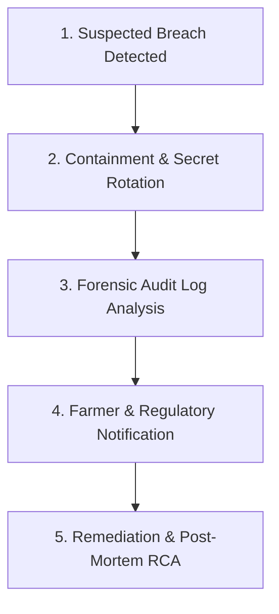

# RythuSetu — Production Security Policy & Incident Response Guide

**Version:** 0.4.0  
**Effective Date:** 2026-09-26  
**Security Contact:** [security@rythusetu.in](mailto:security@rythusetu.in)  
**Classification:** Public Engineering & Operational Standard  

---

## 1. Security Overview & Commitment

RythuSetu is a digital agriculture platform serving smallholder farmers, Agricultural Extension Officers (AEOs), and APMC market administrators across Telangana and Andhra Pradesh. Because our users manage sensitive financial records (Agri Khata), crop loss claims under the Pradhan Mantri Fasal Bima Yojana (PMFBY), and landholding details, security, confidentiality, and data integrity are central to our design.

This document establishes our production security controls, vulnerability reporting policy, credential rotation procedures, and incident response playbook.

---

## 2. Reporting Security Vulnerabilities

We welcome vulnerability disclosures from security researchers, farmers, and community members. We practice responsible disclosure and operate under a safe harbor policy for good-faith testing.

### Reporting Channel
- **Primary Contact:** [security@rythusetu.in](mailto:security@rythusetu.in)
- **Subject Format:** `[VULNERABILITY] <Component>: <Short Description>`
- **Expected Details:**
  1. Component or endpoint affected (e.g., `/api/v1/crop-loss`, `/api/v1/auth/login`)
  2. Proof-of-concept (PoC) steps or minimal reproduction script
  3. Estimated impact and CVSS severity score
  4. Suggested remediation if known

### Service Level Objectives (SLOs)
- **Initial Acknowledgment:** Within **24 hours**
- **Triage & Impact Assessment:** Within **72 hours**
- **Status Updates:** Every **7 days** until patch release
- **Target Remediation Window:** Within **14 days** for High/Critical, **30 days** for Medium

### Safe Harbor Rules
Researchers must:
- Avoid accessing, modifying, or destroying farmer personal data or real claim records.
- Avoid Denial of Service (DoS) attacks or automated high-rate stress tests against production endpoints.
- Provide RythuSetu adequate time to mitigate vulnerabilities before public disclosure.

---

## 3. Production Security Controls

The RythuSetu backend (`backend/app`) and frontend (`frontend/src`) incorporate multiple defense-in-depth security layers.

### 3.1 Authentication & Password Hashing
- **Bcrypt Work Factor:** Passwords are hashed exclusively using `bcrypt` (work factor $\ge 12$). Plaintext or insecure hashing formats (MD5, SHA1) are strictly rejected.
- **Fail-Closed Production Bootstrap:** In `backend/app/core/config.py`, when `APP_ENV=production`, `validate_production_security()` verifies that:
  - `JWT_SECRET_KEY` is explicitly configured and $\ge 32$ characters in length.
  - `ADMIN_INITIAL_PASSWORD` is explicitly configured and $\ge 10$ characters.
  - If either condition is violated, the application terminates immediately with a `RuntimeError` and refuses to accept traffic.
- **Development Fallback:** In `development` mode, high-entropy ephemeral 256-bit keys (`secrets.token_hex(32)`) are auto-generated per process restart.

### 3.2 Token Architecture (JWT)
- **Standard:** RFC 7519 JSON Web Tokens using `HS256` symmetric signing.
- **Token Lifespans:**
  - `access_token`: 30 minutes (`JWT_ACCESS_TOKEN_EXPIRE_MINUTES=30`)
  - `refresh_token`: 7 days (`JWT_REFRESH_TOKEN_EXPIRE_DAYS=7`)
- **Claims Validation:** Tokens encode `sub` (username), `user_id`, `role`, and expiration (`exp`). Revocation occurs when secrets are cycled or when account status is toggled to inactive (`is_active = False`).

### 3.3 Role-Based Access Control (RBAC) & Authorization
Server-side RBAC dependencies (`backend/app/core/auth.py`) enforce access boundaries:
- **`farmer`:** Access to their own farm profile, filing claims, booking machinery/storage, querying prices.
- **`officer`:** Mandal Agriculture Officer (MAO) / AEO permissions: reviewing crop loss reports, verifying field data, posting broadcast advisories.
- **`admin` / `super_admin`:** Platform administration, user management, audit log access, triggering manual mandi data syncs, adjusting MSP reference data.

### 3.4 Broken Object-Level Authorization (BOLA / IDOR) Defense
- Direct object lookups (such as `/api/v1/farmers/{farmer_id}`) are guarded by `get_farmer_or_404(db, farmer_id, current_user)` and `verify_object_ownership()`.
- Cultivators cannot inspect or modify records belonging to other cultivators; any attempt returns HTTP 403 Forbidden and writes an immutable entry into `AuditLog`.

### 3.5 API Rate Limiting
Endpoint rate limiting is enforced by `backend/app/core/rate_limit.py`:
| Endpoint Category | Route Pattern | Rate Limit | Action on Excess |
|---|---|---|---|
| User Registration | `POST /api/v1/auth/register` | 5 requests / min per IP | HTTP 429 Too Many Requests |
| User Login | `POST /api/v1/auth/login` | 10 requests / min per IP | HTTP 429 Too Many Requests |
| Crop Loss Filing | `POST /api/v1/crop-loss` | 10 requests / min per IP | HTTP 429 Too Many Requests |
| Crop Doctor Vision | `POST /api/v1/crop-doctor/analyze` | 15 requests / min per IP | HTTP 429 Too Many Requests |
| Assistant Chat | `POST /api/v1/assistant/chat` | 15 requests / min per IP | HTTP 429 Too Many Requests |
| General Endpoints | `GET /api/v1/*` | 60 requests / min per IP | HTTP 429 Too Many Requests |

### 3.6 Server-Side Request Forgery (SSRF) Protection
The Mandi Ingestion Pipeline (`backend/app/mandi_ingestion.py`) connects to upstream government portals. To prevent SSRF attacks:
- **Domain Allowlist:** Upstream requests are restricted to strictly allowlisted hostnames:
  - `api.data.gov.in`
  - `agmarknet.gov.in`
- **Private IP Blacklist:** Outbound HTTP requests targeting private RFC 1918 addresses (`10.0.0.0/8`, `172.16.0.0/12`, `192.168.0.0/16`), loopback (`127.0.0.0/8`), or link-local (`169.254.0.0/16`) addresses are blocked.
- **URL Scheme Restriction:** Only `https://` is permitted.

### 3.7 Strict Magic-Byte Image Validation
File uploads in Crop Doctor and PMFBY claim intimation (`backend/app/api.py:validate_image_file`) validate actual file contents rather than untrusted MIME types or file extensions:
- **JPEG:** Evaluates magic bytes `0xFF 0xD8 0xFF`
- **PNG:** Evaluates magic bytes `\x89PNG`
- **WebP:** Evaluates container header `RIFF....WEBP`
- **Size Limit:** Uploads exceeding 8 MB are rejected immediately.
- Polyglots, SVG files, HTML scripts, and executable payloads (`.exe`, `.sh`, `.elf`) are rejected with HTTP 400.

### 3.8 HTTP Security Headers
The backend enforces security headers via `SecurityHeadersMiddleware` (`backend/app/main.py`):
```http
X-Content-Type-Options: nosniff
X-Frame-Options: DENY
Referrer-Policy: strict-origin-when-cross-origin
X-XSS-Protection: 1; mode=block
Content-Security-Policy: default-src 'self'; img-src 'self' data: https:; script-src 'self'; style-src 'self' 'unsafe-inline'
```

### 3.9 Cross-Origin Resource Sharing (CORS)
- Production CORS is configured via the `ALLOWED_ORIGINS` environment variable.
- In production, wildcards (`*`) are disallowed when credentials are transmitted.
- Default production origin: `https://rythu-setu.vercel.app`.

---

## 4. Known Security Dependencies

The platform pins all critical security dependencies in `backend/requirements.txt`:

| Package | Minimum Version | Purpose | Security Relevance |
|---|---|---|---|
| `bcrypt` | `>=4.0.0` | Secure password hashing | Constant-time password verification, salt stretching |
| `python-jose[cryptography]` | `>=3.3.0` | JWT token generation & verification | RFC 7519 compliant token signing and payload validation |
| `fastapi` | `>=0.110.0` | Web framework & request routing | Type-safe Pydantic input sanitization and schema enforcement |
| `httpx` | `>=0.27.0` | Outbound HTTP client for Mandi & AI | Strict TLS verification, connection pooling, timeout controls |
| `psycopg[binary]` | `>=3.1.0` | PostgreSQL database driver | Parameterized SQL query execution preventing SQL Injection |
| `pydantic-settings` | `>=2.2.0` | Environment variable parsing | Type casting and configuration validation at startup |

All dependencies are monitored for vulnerabilities via automated GitHub Dependabot alerts and audited with `pip audit`.

---

## 5. Secrets Management

### Rules
1. **Never Commit Secrets:** `.env` files, private API keys, and local SQLite database files are strictly ignored via `.gitignore`.
2. **Render Environment Variables:** In production, all secrets are injected as environment variables in the Render Dashboard (`https://dashboard.render.com`).
3. **Auto-Generated Cryptographic Keys:** `render.yaml` specifies `generateValue: true` for `JWT_SECRET_KEY`, `JWT_REFRESH_SECRET_KEY`, and `ADMIN_INITIAL_PASSWORD`, ensuring Render provisions 64-character high-entropy cryptographic strings automatically.
4. **Third-Party Keys:** External credentials (`DATA_GOV_API_KEY`, `OPENAI_API_KEY`, `WEATHER_API_KEY`) are managed as non-synced secret environment variables in Render.

---

## 6. Credential Rotation Procedures

Rotate credentials on regular 90-day maintenance schedules or immediately upon suspecting an unauthorized exposure.

### 6.1 Rotating `JWT_SECRET_KEY` & `JWT_REFRESH_SECRET_KEY`
> **Impact:** All active sessions will be invalidated immediately. Farmers and officers will need to re-authenticate.

1. Generate a new 64-character high-entropy secret:
   ```bash
   python -c "import secrets; print(secrets.token_hex(32))"
   ```
2. Navigate to **Render Dashboard** $\rightarrow$ **Services** $\rightarrow$ `rythusetu-backend` $\rightarrow$ **Environment**.
3. Update `JWT_SECRET_KEY` and `JWT_REFRESH_SECRET_KEY` with the generated strings.
4. Also update `rythusetu-mandi-sync` if it reads `JWT_SECRET_KEY` directly.
5. Click **Save Changes**. Render will automatically trigger a rolling redeployment.
6. Verify deployment status via `https://rythusetu-backend.onrender.com/readiness`.

### 6.2 Rotating `ADMIN_INITIAL_PASSWORD`
1. Generate a strong password ($\ge 16$ characters with mixed cases, numbers, and symbols):
   ```bash
   python -c "import secrets; print(secrets.token_urlsafe(16))"
   ```
2. In the Render Dashboard, update `ADMIN_INITIAL_PASSWORD` for `rythusetu-backend`.
3. To update an existing database admin user directly without redeployment, connect via `psql` or the Render shell and update the bcrypt hash:
   ```python
   from app.core.security import hash_password
   from app.db import SessionLocal
   from app.models import UserAccount

   db = SessionLocal()
   admin = db.query(UserAccount).filter(UserAccount.username == "admin").first()
   if admin:
       admin.hashed_password = hash_password("YourNewStrongPassword2026!")
       db.commit()
   db.close()
   ```

### 6.3 Rotating `DATA_GOV_API_KEY`
1. Log in to [data.gov.in](https://data.gov.in) $\rightarrow$ **My Account** $\rightarrow$ **API Keys**.
2. Click **Regenerate API Key** and copy the new credential.
3. Open **Render Dashboard** $\rightarrow$ `rythusetu-backend` $\rightarrow$ **Environment**.
4. Update `DATA_GOV_API_KEY` with the new key.
5. Repeat for the cron service `rythusetu-mandi-sync`.
6. Trigger a manual sync test:
   ```bash
   curl -X POST "https://rythusetu-backend.onrender.com/api/v1/admin/mandi/sync" \
     -H "Authorization: Bearer <OFFICER_JWT_TOKEN>"
   ```

### 6.4 Rotating PostgreSQL `DATABASE_URL`
1. In Render Dashboard, navigate to the `rythusetu-db` PostgreSQL instance.
2. Select **Settings** $\rightarrow$ **Rotate Database Credentials**.
3. Render automatically updates the internal `connectionString` referenced in `render.yaml` and restarts dependent services (`rythusetu-backend` and `rythusetu-mandi-sync`).

---

## 7. Incident Response Procedure

Follow this 5-stage protocol when a security event or suspected data breach occurs:



### Stage 1: Detection & Triage
- Trigger alerts from monitoring, failed login spikes, unauthorized API access, or external researcher reports.
- Determine the scope: authentication tokens, database leak, farmer PII, or upstream API compromise.
- Assign an Incident Commander (lead engineer/DevOps).

### Stage 2: Immediate Containment
1. **Rotate Credentials:** Immediately rotate `JWT_SECRET_KEY`, database credentials, and external API keys as documented in Section 6.
2. **Isolate Compromised Accounts:** Toggle `is_active = False` on affected accounts:
   ```python
   db.query(UserAccount).filter(UserAccount.id == compromised_user_id).update({"is_active": False})
   db.commit()
   ```
3. **Rate Limit / IP Block:** If malicious traffic originates from identifiable IP blocks, configure an edge deny rule in Vercel or Cloudflare.

### Stage 3: Forensic Audit Log Inspection
RythuSetu records critical operations in the `audit_logs` table (`app.models.AuditLog`). Execute queries to analyze suspicious activity:
```sql
-- Query suspicious logins or claim modifications in the last 24 hours
SELECT id, username, role, action, resource_type, resource_id, ip_address, timestamp
FROM audit_logs
WHERE timestamp >= NOW() - INTERVAL '24 hours'
ORDER BY timestamp DESC;
```
Check for unauthorized `CLAIM_STATUS_UPDATE`, `MANDI_PRICE_UPDATE`, or anomalous `LOGIN` actions.

### Stage 4: User & Regulatory Notification
- If personal data (farmer names, Aadhaar-linked records, bank details, or PMFBY claim dossiers) is confirmed to have been exposed, formulate notifications under the Digital Personal Data Protection Act (DPDP Act 2023) guidelines.
- Notify impacted cultivators via SMS/in-app notification within **72 hours** of breach confirmation.
- Transparently state:
  1. What data elements were affected.
  2. The protective actions RythuSetu has executed (tokens revoked, passwords reset).
  3. Action steps recommended for the farmer (e.g., verifying bank account statements).

### Stage 5: Post-Incident Remediation & RCA
- Draft a formal Root Cause Analysis (RCA) document within **5 business days**.
- Document timeline, technical failure mechanism, breach blast radius, and permanent architectural mitigations.
- Commit fixes with associated automated regression tests in `test_features.py`.

---

## 8. Git Secret Exposure Recovery Playbook

If a secret or private credential is accidentally committed to Git:

1. **Immediate Revocation (DO NOT WAIT TO EDIT GIT):**
   - The secret is compromised the second it is pushed to a remote repository.
   - Immediately regenerate the exposed key on Render, OpenAI, or Data.gov.in.
2. **Purge Secret from History:**
   Use `git-filter-repo` (recommended) or the BFG Repo-Cleaner:
   ```bash
   # Install git-filter-repo
   pip install git-filter-repo

   # Remove file containing secret from git history
   git filter-repo --invert-paths --path .env

   # Or replace text matching secret string
   git filter-repo --replace-text <(echo 'compromised_secret==>REDACTED')
   ```
3. **Force Push Cleaned Tree:**
   ```bash
   git push origin main --force --all
   ```
4. **Audit Clones:**
   Ensure all team members pull the rewritten tree (`git fetch origin && git reset --hard origin/main`).
5. **Log Security Incident:**
   Record the exposure in the internal security log and verify that the rotated key is live in production.
